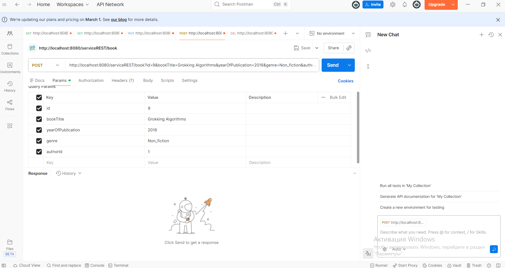

# Service REST
This Java project uses CRUD-operations: **GET**, **POST**, **PUT**, **PATCH**, **DELETE** to interact with objects.

| Method | Purpose              | Description                                      |
|--------|----------------------|--------------------------------------------------|
| GET    | Read data            | Retrieve authors or books from the database     |
| POST   | Create new data      | Add a new author or book to the database        |
| PUT    | Update full object   | Update all fields of an existing author or book |
| PATCH  | Partial update       | Update specific fields of an existing object    |
| DELETE | Remove data          | Delete an author or book from the database      |
## Description
The REST Service accepts input data in the form of an **AuthorDTO** object, which contains the first name, last name, phone number, and email address, as well as a **BookDTO** object with the following fields: book title, year of publication, genre, and author id.

After that, you can choose one of the operations and apply it to the corresponding object.
## Features
- There is a relationship between the **author id** field and the author entity itself: when an author is deleted, all books associated with that author’s id are also deleted.
- You can add yourself as an author and create your own book.
- Error handling is implemented for invalid input data.
## Usage

To use the REST service, you need to use **Postman** and send one of the available requests.

For example, you can send a **POST request** with a JSON payload containing the required parameters. The service will add the data to the database

Example JSON Request:
```
{
    "bookTitle": "Grokking Algorithms",
    "yearOfPublication": 2016,
    "genre": Non_fiction,
    "authorId": 1
}
```
For example:


## License
This project is licensed under the MIT License.

